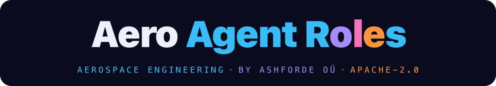
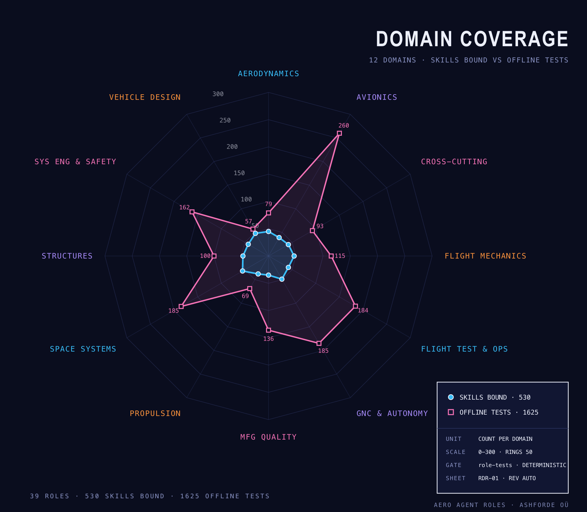
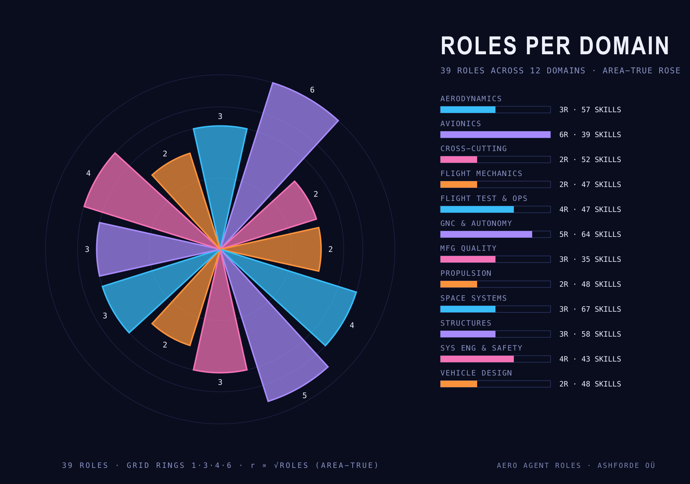
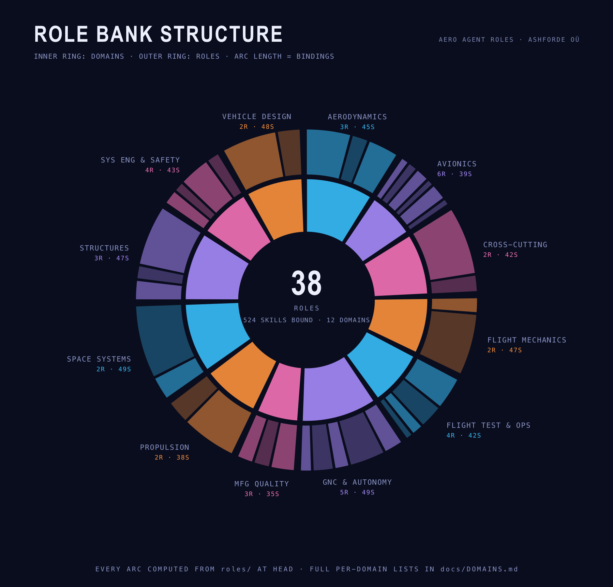
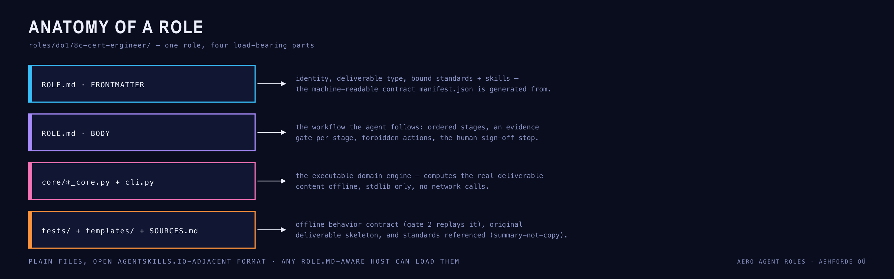
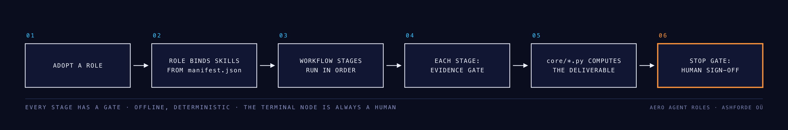
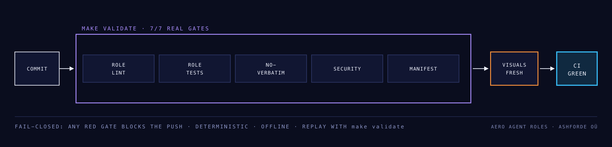

<p align="center">
  
</p>

<p align="center">
  
</p>

<p align="center">
  <strong>The role layer for aerospace engineering agents.</strong><br>
  Roles bind verified Aero Agent Skills leaves into end-to-end deliverables — certification plans, compliance matrices, audit reports — with evidence gates and a human sign-off line.
</p>

<!-- gen:statline -->
<p align="center">
  
</p>
<!-- /gen:statline -->

<!-- gen:badges -->
<p align="center">
  <a href="roles/"></a>
  <a href="https://github.com/ashfordeOU/aero-agent-skills"></a>
  <a href="roles/"></a>
  <a href="STANDARDS.md"></a>
  <a href="https://agentskills.io"></a>
  <a href="LICENSE"></a>
</p>
<p align="center">
  <a href="https://www.npmjs.com/package/aero-agent-roles"></a>
  <a href="packages/aero-agent-roles/"></a>
  <a href="packages/aero-agent-roles/lib/mcp.js"></a>
  <a href=".claude-plugin/"></a>
  <a href="packages/jetbrains-plugin/"></a>
</p>
<!-- /gen:badges -->

<p align="center">
  <a href="#domain-map">Domain map</a> ·
  <a href="#roles">Roles</a> ·
  <a href="#how-a-role-works">How a role works</a> ·
  <a href="#standards-discipline">Standards discipline</a> ·
  <a href="#quality-gates">Quality gates</a> ·
  <a href="#roadmap">Roadmap</a> ·
  <a href="#faq">FAQ</a>
</p>

---

Aero Agent Skills is the verified knowledge layer: 500+ gated, tested,
standards-anchored skills. Aero Agent Roles packages that knowledge into
**roles that own a deliverable end to end**. Instead of assembling thirty
skill files, adopt a role. The role knows the workflow order, the evidence
each stage must produce, and the hard boundary where a human signs.

> **Skills = "do this task correctly."**
> **Roles = "own this deliverable end to end."**

## Quick start

**Every package Aero Agent Roles ships — pick the one that fits your host:**

| Package / channel | What it gives you | Get it |
|---|---|---|
| **npm CLI** `aero-agent-roles` | `list` · `search` · `show` · `install` · `mcp` · `where` — one zero-dependency binary | `npm i -g aero-agent-roles` (aliases: `aero-roles`, `npx aero-roles`) |
| **MCP server** (same package) | `search_roles` / `get_role` tools for any MCP host — Claude Desktop, VS Code, Cursor, Windsurf, Gemini CLI, JetBrains AI Assistant | add the JSON block below to your MCP config |
| **JetBrains plugin** | role catalog tool window + **Copy MCP Config** / **Copy Registry URL** / **Docs** actions inside the IDE | [Marketplace plugin 34121](https://plugins.jetbrains.com/plugin/34121-aero-agent-roles) → Settings → Plugins → `Aero Agent Roles` |
| **Claude Code plugin** | role routers on demand via the agent-skills marketplace | `claude plugin marketplace add ashfordeOU/aero-agent-roles` |
| **GitHub repo** | full source: every role, cores, tests, docs | `git clone https://github.com/ashfordeOU/aero-agent-roles` |
| **Role folders (any host)** | copy any role's folder into your harness — roles are files | `npx aero-roles install <role> --dest <dir>` or clone + `cp -r` |

**1 · Browse without installing (npm CLI, no setup):**

```bash
npx -y aero-roles list                       # browse domains + roles
npx -y aero-roles search "DO-178C certification plan"
npx -y aero-roles show do178c-cert-engineer  # print one ROLE.md
```

**2 · Install the CLI + run a role's executable engine:**

```bash
npm i -g aero-agent-roles
aero-roles list
aero-roles search "ARP4754A integration plan"
# install a role folder into a working directory, then build its deliverable:
aero-roles install do178c-cert-engineer --dest ./my-program
python3 ./my-program/do178c-cert-engineer/cli.py build --out plan.md
```

**3 · Connect over MCP** — Claude Desktop, VS Code, Cursor, Windsurf, Gemini CLI, or any Model Context Protocol host. **Working from this repo? The server lives in the repo** — see [MCP.md](MCP.md): the committed `.mcp.json` registers it with editors project-scope, and `bash scripts/mcp-install.sh` wires every host found on the machine (Claude Code, Hermes, self-verify). Consumers use the published copy:

```json
{
  "mcpServers": {
    "aero-agent-roles": { "command": "npx", "args": ["-y", "aero-agent-roles", "mcp"] }
  }
}
```

**4 · Install the JetBrains IDE plugin** (AI Assistant / Junie integration, role catalog in the IDE):

- Marketplace: **[Aero Agent Roles on the JetBrains Marketplace](https://plugins.jetbrains.com/plugin/34121-aero-agent-roles)**
- In the IDE: **Settings → Plugins → Marketplace** → search `Aero Agent Roles` → Install
- The plugin adds a tool window with the role catalog, a **Copy MCP Server Config** action (one-click registration for AI Assistant / Junie), a **Copy Registry URL** action, and a **Docs** action to the landing page

**5 · Or as a Claude Code plugin** — role routers load on demand and pull the bound skills:

```bash
claude plugin marketplace add ashfordeOU/aero-agent-roles
claude plugin install aero-agent-roles@aero-agent-roles
```

**6 · Or copy a folder** — roles are just files:

```bash
git clone https://github.com/ashfordeOU/aero-agent-roles
cp -r aero-agent-roles/roles/do178c-cert-engineer ~/your-workspace/
```

Every role ships as an executable worker: core engine + CLI + filled template + tests, gated by `make validate` (5/5) and the 100% audit. Publisher: **[aero-agent-roles on npm](https://www.npmjs.com/package/aero-agent-roles)** by Ashforde OÜ, Apache-2.0.

## Domain map

<!-- gen:overview -->
**38 roles** across **12 domains**, binding **597 skills** from Aero Agent Skills and verified by **1519 offline tests** — every figure below is computed from the tree at HEAD; nothing is hand-counted.
<!-- /gen:overview -->

<p align="center">
  
</p>

<p align="center">
  
</p>

Full per-domain role lists: **[docs/DOMAINS.md](docs/DOMAINS.md)**.

## Roles

<p align="center">
  
</p>

Each role directory contains `ROLE.md` (the contract), `templates/`
(original deliverable skeletons), `tests/` (offline verification), and
`SOURCES.md` (standards referenced).

<!-- gen:role-table -->
| Role | Deliverable | Skills bound |
|---|---|---|
| [ADCS Engineer](roles/adcs-engineer/ROLE.md) | Attitude Determination and Control Subsystem Report | 14 |
| [AS9100 Quality / Internal Auditor](roles/as9100-quality-auditor/ROLE.md) | audit plan + findings report + corrective-action follow-up | 15 |
| [AS9100 Quality Management Engineer](roles/quality-management-engineer/ROLE.md) | AS9100 quality management system audit report | 10 |
| [Aerodynamics Engineer](roles/aerodynamics-engineer/ROLE.md) | aerodynamic design + analysis report | 28 |
| [Aircraft Conceptual Design Engineer](roles/aircraft-design-engineer/ROLE.md) | concept design package (sizing + layout + cost) | 34 |
| [Aircraft Performance Engineer](roles/aircraft-performance-engineer/ROLE.md) | Aircraft Performance Analysis Report | 9 |
| [Aircraft Systems Sizing Engineer](roles/aircraft-systems-sizing-engineer/ROLE.md) | Aircraft System Sizing Report | 14 |
| [Airworthiness Compliance Engineer](roles/airworthiness-compliance-engineer/ROLE.md) | compliance checklist / certification matrix | 9 |
| [Autopilot Control Engineer](roles/autopilot-control-engineer/ROLE.md) | autopilot control law design package | 12 |
| [Boundary-Layer Engineer](roles/boundary-layer-engineer/ROLE.md) | boundary-layer and viscous drag analysis report | 10 |
| [Composite Structures Engineer (Analysis + Certification Evidence)](roles/composites-structures-engineer/ROLE.md) | composite structure analysis + certification report | 12 |
| [DO-160G Environmental Qualification Engineer](roles/do160-environmental-engineer/ROLE.md) | equipment environmental qualification plan/report | 6 |
| [DO-178C Software Certification Engineer](roles/do178c-cert-engineer/ROLE.md) | certification plan + verification evidence set | 9 |
| [DO-254 Airborne Electronic Hardware Engineer](roles/do254-hardware-engineer/ROLE.md) | Plan for Hardware Aspects of Certification (PHAC) + design assurance evidence set | 4 |
| [Data Bus / Avionics Network Engineer](roles/data-bus-avionics-engineer/ROLE.md) | avionics data bus loading + protocol assessment | 5 |
| [Engineering Analysis and Data Engineer](roles/engineering-analysis-engineer/ROLE.md) | analysis verification + engineering report | 42 |
| [Finite Element Analysis Engineer](roles/fem-analysis-engineer/ROLE.md) | Finite Element Analysis Report | 8 |
| [Flight Management Engineer](roles/flight-management-engineer/ROLE.md) | flight plan and RNAV/RNP route assessment | 11 |
| [Flight Mechanics Engineer](roles/flight-mechanics-engineer/ROLE.md) | performance + stability and control analysis report | 38 |
| [Flight Software Engineer](roles/flight-software-engineer/ROLE.md) | Flight Software Design and Verification Plan | 4 |
| [Flight Test Engineer](roles/flight-test-engineer/ROLE.md) | flight test plan + envelope expansion report | 21 |
| [Flight Test Performance Engineer](roles/flight-test-performance-engineer/ROLE.md) | flight test performance data analysis report | 15 |
| [Flight Test Planning Engineer](roles/flight-test-planning-engineer/ROLE.md) | Flight Test Plan and Requirements Traceability | 7 |
| [Guidance Engineer](roles/guidance-engineer/ROLE.md) | guidance law design and assessment report | 9 |
| [Guidance, Navigation and Control (GNC) Engineer](roles/gnc-engineer/ROLE.md) | control design + guidance/navigation analysis report | 23 |
| [High-Speed Aerodynamics Engineer](roles/high-speed-aerodynamics-engineer/ROLE.md) | High-Speed Aerodynamic Analysis Memo | 19 |
| [MBSE Modeling Engineer](roles/mbse-modeling-engineer/ROLE.md) | system model architecture + MBSE plan | 6 |
| [NDT Engineer](roles/ndt-engineer/ROLE.md) | nondestructive test plan + method selection report | 10 |
| [Navigation Engineer](roles/navigation-engineer/ROLE.md) | navigation architecture and position error analysis report | 13 |
| [Numerical Analysis Engineer](roles/numerical-analysis-engineer/ROLE.md) | numerical methods verification memo | 10 |
| [Propulsion Engineer](roles/propulsion-engineer/ROLE.md) | propulsion system design + cycle analysis report | 34 |
| [Rocket Propulsion Engineer](roles/rocket-propulsion-engineer/ROLE.md) | rocket propulsion system design report | 14 |
| [Safety Assessment Engineer (ARP4761A)](roles/safety-assessment-engineer/ROLE.md) | Aircraft/System Safety Assessment Report (ARP4761A) | 20 |
| [Space Systems Engineer](roles/space-systems-engineer/ROLE.md) | spacecraft mission + subsystem design report | 45 |
| [Stability and Control Flight Test Engineer](roles/stability-control-flight-test-engineer/ROLE.md) | Stability and Control Flight Test Report | 4 |
| [State Estimation Engineer](roles/state-estimation-engineer/ROLE.md) | navigation state estimator design report | 7 |
| [Structures and Loads Engineer](roles/structures-loads-engineer/ROLE.md) | loads + strength/stability analysis report | 38 |
| [Systems Integration Engineer](roles/systems-integration-engineer/ROLE.md) | System Development Assurance and Integration Plan (ARP4754A) | 8 |
<!-- /gen:role-table -->

### See a role

This is the artifact — one real role, exactly as agents receive it:

<details>
<summary><code>do178c-cert-engineer</code> — ROLE.md frontmatter (excerpt)</summary>

```yaml
name: do178c-cert-engineer
title: "DO-178C Software Certification Engineer"
domain: avionics
deliverable_type: "certification plan + verification evidence set"
standards_bound:
  - id: do-178c
    tier: TIER-2
    reference-only: true
skills_bound:
  - avionics/do178c/planning
  - avionics/do178c/development
  - avionics/do178c/verification
```

</details>

The body walks the agent through: planning → development framework →
verification strategy → test evidence → configuration management → tool
qualification → previously-developed-software check → data/control
coupling analysis → airworthiness liaison — **where the agent must stop
and let a human sign**.

<p align="center">
  
</p>

## How a role works

<p align="center">
  
</p>

A role binds real, existing skills from Aero Agent Skills and orders them
into the workflow a practicing engineer follows. The DO-178C role runs:
planning, development framework, verification strategy, test evidence,
configuration management, tool qualification, previously-developed-
software check, data/control coupling analysis, airworthiness liaison.
Each stage has an evidence gate. The output is a draft for human review.

Every role ends at the same line: **the human sign-off**. Roles produce
draft deliverables with evidence. They never issue certification approval,
declare compliance findings, or claim regulatory sign-off.

## Standards discipline

Aerospace standards are largely proprietary (RTCA, EUROCAE, SAE, IAQG).
This repository follows the same **summary-not-copy** rule as Aero Agent
Skills: name + paraphrase + short attributed quotes, never reproduction.
Public-domain regulations (FAR/CS) are quotable with citation. See
[STANDARDS.md](STANDARDS.md) for the full reference.

## Quality gates

Every role passes a 5-gate battery before it ships:

<p align="center">
  
</p>

```bash
make validate
```

1. **Role lint** - structure, frontmatter, bound-skill resolution
2. **Role tests** - offline suite passes (skills resolve, workflow deterministic)
3. **No-verbatim** - no proprietary standard text reproduced
4. **Security** - no secrets, credentials, local paths
5. **Manifest** - generated manifest matches the tree

## Layout

```
roles/<role-slug>/
├── ROLE.md          # the role contract
├── templates/       # original deliverable skeletons
├── tests/           # offline role tests
└── SOURCES.md       # standards referenced by the role
docs/                # role anatomy standard, handover
scripts/             # gates and role tooling
```

## Roadmap

**Shipped:** 33 professional roles binding 534 verified Aero Agent
Skills leaves across 12 engineering domains, every role an executable
worker (core engine + CLI + filled template + tests) gated by
`make validate` (5/5) and the 100% audit — from DO-178C certification
engineer and DO-254 hardware engineer to structures, composites,
FEA, avionics data bus, GNC guidance/state-estimation, flight test
performance, safety assessment (ARP4761A), systems integration
(ARP4754A), MBSE, quality management (AS9100), NDT, and high-speed
aerodynamics. Evidence protocol (`--bundle`) emits
deliverable + model.json + gates.json + provenance.json for any
harness; program profiles (`--profile`) tailor one engine to any
customer's basis; npm CLI + MCP server packaged
(`aero-agent-roles@1.1.0` live on npm), JetBrains plugin
(com.ashforde.aeroroles) on the Marketplace, GitHub release v1.1.0 —
all shipped from the public tree with zero human action.

**Now:** role waves selected deterministically by the coverage planner
(`scripts/wave-planner.py`) and dispatched autonomously (30-min tick,
monitor-gated) — expanding into every engineering family (propulsion,
space systems, structures, quality), every new role landing with its
core engine, filled deliverable, bundle protocol, and dispatch
cross-checks against the live skills library.

**Later:** the role-count release ladder continues (v1.2.0 @ 50
roles) with npm publish from the public tree; role chains that
orchestrate multi-role programs (cert engineer ← structures ← flight
test); reference builds for airframers and suppliers; marketplace
listings alongside Aero Agent Skills.

## Contributing

Read [CONTRIBUTING.md](CONTRIBUTING.md) before opening a PR: every role
ships with its executable core + filled template + tests, every
contributor certifies their submission contains no controlled data and
no verbatim standards text, every merge must pass `make validate` (5/5)
and `make growth`.

## Security

Roles are executable workers — review the core engine, `cli.py`, and any
bound-skill logic before you run one, the same way you would review any
code dependency. Report vulnerabilities privately per
[SECURITY.md](SECURITY.md).

## FAQ

[docs/FAQ.md](docs/FAQ.md) covers license, certification status, export
control, what verified means, roles-vs-skills, and affiliation. Short
answers: Apache-2.0, not certified, not controlled as published,
verified = replayable `make validate` 5/5 + the 100% audit on the commit
you are looking at, roles = executable workers on the skills substrate,
not affiliated with RTCA, SAE, EASA, FAA, or any government.

## Compliance notice

Aero Agent Roles is an open, unrestricted library of civil aerospace
engineering methodology for AI agents, published by Ashforde OÜ
(Estonia) under Apache-2.0. The content is educational: general
engineering principles, processes, and tool-usage guidance. It is not
ITAR/EAR-controlled technical data, and no proprietary standards text
is reproduced. Standards are referenced and summarized only (see
[STANDARDS.md](STANDARDS.md)). As published, this library falls within
the EU dual-use "public domain" exclusion (Annex I General Technology
Note, Regulation (EU) 2021/821). Users are solely responsible for their
own compliance. Not affiliated with or endorsed by RTCA, EUROCAE, SAE
International, IAQG, EASA, FAA, or any government.

## License

Apache-2.0. See [LICENSE](LICENSE) · [NOTICE](NOTICE) ·
[SECURITY.md](SECURITY.md) · [CONTRIBUTING.md](CONTRIBUTING.md) ·
[STANDARDS.md](STANDARDS.md) · [CODE_OF_CONDUCT.md](CODE_OF_CONDUCT.md)

Aero Agent Roles is built and maintained by Ashforde OÜ (Estonia).
Copyright © 2026 Ashforde OÜ.

## Related

- [Aero Agent Skills](https://github.com/ashfordeOU/aero-agent-skills) - the knowledge substrate this role bank builds on
- [Aero Agent Roles on the web](https://ashforde.org/aeroagentroles/)

---

<div align="center">

### ⭐ Stars are our telemetry

**Every star steers the flight plan — it decides which engineering family gets the next role wave.**<br>
**If a role saved your team a certification cycle, send one back.**

<a href="https://github.com/ashfordeOU/aero-agent-roles/stargazers"></a>

</div>
