# Aero Agent Roles Domain Map

Machine-readable source of truth: `roles/*/ROLE.md` frontmatter. This
page is the human companion — 12 domains, 29 roles, 490 skills bound.

Generated by `make visuals` (scripts/gen_visuals.py) — do not edit by hand;
CI fails if this page drifts from the tree. Aero Agent Roles is built and
maintained by [Ashforde OÜ](https://ashforde.org).

```mermaid
graph TD
    ROOT[Aero Agent Roles]
    aerodynamics[aerodynamics]
    ROOT --> aerodynamics
    aerodynamics_aerodynamics_engineer[aerodynamics-engineer · 28]
    aerodynamics --> aerodynamics_aerodynamics_engineer
    aerodynamics_high_speed_aerodynamics_engineer[high-speed-aerodynamics-engineer · 19]
    aerodynamics --> aerodynamics_high_speed_aerodynamics_engineer
    avionics[avionics]
    ROOT --> avionics
    avionics_data_bus_avionics_engineer[data-bus-avionics-engineer · 5]
    avionics --> avionics_data_bus_avionics_engineer
    avionics_do160_environmental_engineer[do160-environmental-engineer · 6]
    avionics --> avionics_do160_environmental_engineer
    avionics_do178c_cert_engineer[do178c-cert-engineer · 9]
    avionics --> avionics_do178c_cert_engineer
    avionics_do254_hardware_engineer[do254-hardware-engineer · 4]
    avionics --> avionics_do254_hardware_engineer
    avionics_flight_management_engineer[flight-management-engineer · 11]
    avionics --> avionics_flight_management_engineer
    avionics_flight_software_engineer[flight-software-engineer · 4]
    avionics --> avionics_flight_software_engineer
    cross_cutting[cross-cutting]
    ROOT --> cross_cutting
    cross_cutting_engineering_analysis_engineer[engineering-analysis-engineer · 42]
    cross_cutting --> cross_cutting_engineering_analysis_engineer
    cross_cutting_numerical_analysis_engineer[numerical-analysis-engineer · 10]
    cross_cutting --> cross_cutting_numerical_analysis_engineer
    flight_mechanics[flight-mechanics]
    ROOT --> flight_mechanics
    flight_mechanics_aircraft_performance_engineer[aircraft-performance-engineer · 9]
    flight_mechanics --> flight_mechanics_aircraft_performance_engineer
    flight_mechanics_flight_mechanics_engineer[flight-mechanics-engineer · 38]
    flight_mechanics --> flight_mechanics_flight_mechanics_engineer
    flight_test_operations[flight-test-operations]
    ROOT --> flight_test_operations
    flight_test_operations_flight_test_engineer[flight-test-engineer · 21]
    flight_test_operations --> flight_test_operations_flight_test_engineer
    flight_test_operations_flight_test_performance_engineer[flight-test-performance-engineer · 15]
    flight_test_operations --> flight_test_operations_flight_test_performance_engineer
    flight_test_operations_flight_test_planning_engineer[flight-test-planning-engineer · 7]
    flight_test_operations --> flight_test_operations_flight_test_planning_engineer
    flight_test_operations_stability_control_flight_test_engineer[stability-control-flight-test-engineer · 4]
    flight_test_operations --> flight_test_operations_stability_control_flight_test_engineer
    gnc_autonomy[gnc-autonomy]
    ROOT --> gnc_autonomy
    gnc_autonomy_gnc_engineer[gnc-engineer · 23]
    gnc_autonomy --> gnc_autonomy_gnc_engineer
    gnc_autonomy_guidance_engineer[guidance-engineer · 9]
    gnc_autonomy --> gnc_autonomy_guidance_engineer
    gnc_autonomy_state_estimation_engineer[state-estimation-engineer · 7]
    gnc_autonomy --> gnc_autonomy_state_estimation_engineer
    manufacturing_quality[manufacturing-quality]
    ROOT --> manufacturing_quality
    manufacturing_quality_as9100_quality_auditor[as9100-quality-auditor · 15]
    manufacturing_quality --> manufacturing_quality_as9100_quality_auditor
    manufacturing_quality_ndt_engineer[ndt-engineer · 10]
    manufacturing_quality --> manufacturing_quality_ndt_engineer
    propulsion[propulsion]
    ROOT --> propulsion
    propulsion_propulsion_engineer[propulsion-engineer · 34]
    propulsion --> propulsion_propulsion_engineer
    space_systems[space-systems]
    ROOT --> space_systems
    space_systems_space_systems_engineer[space-systems-engineer · 45]
    space_systems --> space_systems_space_systems_engineer
    structures[structures]
    ROOT --> structures
    structures_structures_loads_engineer[structures-loads-engineer · 38]
    structures --> structures_structures_loads_engineer
    systems_engineering_safety[systems-engineering-safety]
    ROOT --> systems_engineering_safety
    systems_engineering_safety_airworthiness_compliance_engineer[airworthiness-compliance-engineer · 9]
    systems_engineering_safety --> systems_engineering_safety_airworthiness_compliance_engineer
    systems_engineering_safety_mbse_modeling_engineer[mbse-modeling-engineer · 6]
    systems_engineering_safety --> systems_engineering_safety_mbse_modeling_engineer
    systems_engineering_safety_safety_assessment_engineer[safety-assessment-engineer · 20]
    systems_engineering_safety --> systems_engineering_safety_safety_assessment_engineer
    systems_engineering_safety_systems_integration_engineer[systems-integration-engineer · 8]
    systems_engineering_safety --> systems_engineering_safety_systems_integration_engineer
    vehicle_design[vehicle-design]
    ROOT --> vehicle_design
    vehicle_design_aircraft_design_engineer[aircraft-design-engineer · 34]
    vehicle_design --> vehicle_design_aircraft_design_engineer
```

*29 roles · 490 skills bound rendered above.*

## aerodynamics

**2 roles · 47 skills bound · 52 offline tests**

| Role | Deliverable | Skills bound | Tests |
|---|---|---|---|
| [Aerodynamics Engineer](../roles/aerodynamics-engineer/ROLE.md) | aerodynamic design + analysis report | 28 | 17 |
| [High-Speed Aerodynamics Engineer](../roles/high-speed-aerodynamics-engineer/ROLE.md) | High-Speed Aerodynamic Analysis Memo | 19 | 35 |

## avionics

**6 roles · 39 skills bound · 260 offline tests**

| Role | Deliverable | Skills bound | Tests |
|---|---|---|---|
| [DO-160G Environmental Qualification Engineer](../roles/do160-environmental-engineer/ROLE.md) | equipment environmental qualification plan/report | 6 | 49 |
| [DO-178C Software Certification Engineer](../roles/do178c-cert-engineer/ROLE.md) | certification plan + verification evidence set | 9 | 18 |
| [DO-254 Airborne Electronic Hardware Engineer](../roles/do254-hardware-engineer/ROLE.md) | Plan for Hardware Aspects of Certification (PHAC) + design assurance evidence set | 4 | 38 |
| [Data Bus / Avionics Network Engineer](../roles/data-bus-avionics-engineer/ROLE.md) | avionics data bus loading + protocol assessment | 5 | 42 |
| [Flight Management Engineer](../roles/flight-management-engineer/ROLE.md) | flight plan and RNAV/RNP route assessment | 11 | 59 |
| [Flight Software Engineer](../roles/flight-software-engineer/ROLE.md) | Flight Software Design and Verification Plan | 4 | 54 |

## cross-cutting

**2 roles · 52 skills bound · 93 offline tests**

| Role | Deliverable | Skills bound | Tests |
|---|---|---|---|
| [Engineering Analysis and Data Engineer](../roles/engineering-analysis-engineer/ROLE.md) | analysis verification + engineering report | 42 | 41 |
| [Numerical Analysis Engineer](../roles/numerical-analysis-engineer/ROLE.md) | numerical methods verification memo | 10 | 52 |

## flight-mechanics

**2 roles · 47 skills bound · 115 offline tests**

| Role | Deliverable | Skills bound | Tests |
|---|---|---|---|
| [Aircraft Performance Engineer](../roles/aircraft-performance-engineer/ROLE.md) | Aircraft Performance Analysis Report | 9 | 73 |
| [Flight Mechanics Engineer](../roles/flight-mechanics-engineer/ROLE.md) | performance + stability and control analysis report | 38 | 42 |

## flight-test-operations

**4 roles · 47 skills bound · 184 offline tests**

| Role | Deliverable | Skills bound | Tests |
|---|---|---|---|
| [Flight Test Engineer](../roles/flight-test-engineer/ROLE.md) | flight test plan + envelope expansion report | 21 | 32 |
| [Flight Test Performance Engineer](../roles/flight-test-performance-engineer/ROLE.md) | flight test performance data analysis report | 15 | 45 |
| [Flight Test Planning Engineer](../roles/flight-test-planning-engineer/ROLE.md) | Flight Test Plan and Requirements Traceability | 7 | 54 |
| [Stability and Control Flight Test Engineer](../roles/stability-control-flight-test-engineer/ROLE.md) | Stability and Control Flight Test Report | 4 | 53 |

## gnc-autonomy

**3 roles · 39 skills bound · 112 offline tests**

| Role | Deliverable | Skills bound | Tests |
|---|---|---|---|
| [Guidance Engineer](../roles/guidance-engineer/ROLE.md) | guidance law design and assessment report | 9 | 41 |
| [Guidance, Navigation and Control (GNC) Engineer](../roles/gnc-engineer/ROLE.md) | control design + guidance/navigation analysis report | 23 | 29 |
| [State Estimation Engineer](../roles/state-estimation-engineer/ROLE.md) | navigation state estimator design report | 7 | 42 |

## manufacturing-quality

**2 roles · 25 skills bound · 94 offline tests**

| Role | Deliverable | Skills bound | Tests |
|---|---|---|---|
| [AS9100 Quality / Internal Auditor](../roles/as9100-quality-auditor/ROLE.md) | audit plan + findings report + corrective-action follow-up | 15 | 32 |
| [NDT Engineer](../roles/ndt-engineer/ROLE.md) | nondestructive test plan + method selection report | 10 | 62 |

## propulsion

**1 roles · 34 skills bound · 31 offline tests**

| Role | Deliverable | Skills bound | Tests |
|---|---|---|---|
| [Propulsion Engineer](../roles/propulsion-engineer/ROLE.md) | propulsion system design + cycle analysis report | 34 | 31 |

## space-systems

**1 roles · 45 skills bound · 33 offline tests**

| Role | Deliverable | Skills bound | Tests |
|---|---|---|---|
| [Space Systems Engineer](../roles/space-systems-engineer/ROLE.md) | spacecraft mission + subsystem design report | 45 | 33 |

## structures

**1 roles · 38 skills bound · 37 offline tests**

| Role | Deliverable | Skills bound | Tests |
|---|---|---|---|
| [Structures and Loads Engineer](../roles/structures-loads-engineer/ROLE.md) | loads + strength/stability analysis report | 38 | 37 |

## systems-engineering-safety

**4 roles · 43 skills bound · 162 offline tests**

| Role | Deliverable | Skills bound | Tests |
|---|---|---|---|
| [Airworthiness Compliance Engineer](../roles/airworthiness-compliance-engineer/ROLE.md) | compliance checklist / certification matrix | 9 | 25 |
| [MBSE Modeling Engineer](../roles/mbse-modeling-engineer/ROLE.md) | system model architecture + MBSE plan | 6 | 49 |
| [Safety Assessment Engineer (ARP4761A)](../roles/safety-assessment-engineer/ROLE.md) | Aircraft/System Safety Assessment Report (ARP4761A) | 20 | 47 |
| [Systems Integration Engineer](../roles/systems-integration-engineer/ROLE.md) | System Development Assurance and Integration Plan (ARP4754A) | 8 | 41 |

## vehicle-design

**1 roles · 34 skills bound · 27 offline tests**

| Role | Deliverable | Skills bound | Tests |
|---|---|---|---|
| [Aircraft Conceptual Design Engineer](../roles/aircraft-design-engineer/ROLE.md) | concept design package (sizing + layout + cost) | 34 | 27 |
